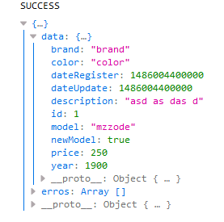

#Jobs
>CRUD para veículos
```
Teste realizado para Projetas
```
O projeto é um simples CRUD para veículos, sendo algumas informações validadas. 
O servidor disponibiliza uma API para realizar o CRUD, e o cliente pode realizar 
requisições para acessa-las.

##Exemplo de uso
O cliente realizar requisições e as respostas podem ser acompanhada no console.log().



As respostas foram padronizadas com o ResponseJson, com data (para enviar um Object desejado) 
e erros contendo uma lista de erros a serem corrigido pelo o cliente. 

As respostas da API são: as informações do veículo; status; e em caso de erros, 
é retornado uma lista de erros.

Na Nav tem 3 opções Create, List e Find (também a um search). Após clicar no List, tem duas opções: Update e Delete.

##Configuração para Desenvolvimento
Projeto usando o Maven, para instalar as dependências

```
mvn install
```
e para realizar os testes
```
mvn test
```
BD utilizado é HSQLBD (em memória), caso seja necessário outro, está configurado um Postgres
```
#spring.jpa.database-platform=org.hibernate.dialect.PostgreSQLDialect
#spring.datasource.driverClassName=org.postgresql.Driver
#spring.datasource.url=jdbc:postgresql://localhost:5432/jobs
#spring.datasource.username=postgres
#spring.datasource.password=123456
#
#spring.jpa.hibernate.ddl-auto=create-drop
``` 
sendo necessario apenas descomentar no _application.properties_ e a dependencia no _pom.xml_
##Histórico de lançamentos

* 0.1
    * ADICIONADO: ApiController
    * ADICIONADO: ResponseJson
* 0.2
    * ADICIONADO: HomeController
    * ADICIONADO: Pagina Home
* 0.3
    * ADICIONADO: Testes para API
* 0.3.1
    * CONSERTADO: ResponseJson
    * ADICIONADO: SimpleCORSFilter
* 0.4
    * CONSERTADO: Projeto refatorado
* 0.5
    * CONSERTADO: Alterado BD Postgres para HSQLBD    
* 0.6
    * EM ANDAMENTO

##Meta
Mateus Cordeiro Silva Alves - [@Mateus Cordeiro](https://www.linkedin.com/in/mateus-cordeiro/) - mateuscordeiro@ffm.com.br

https://github.com/MateusCordeiro